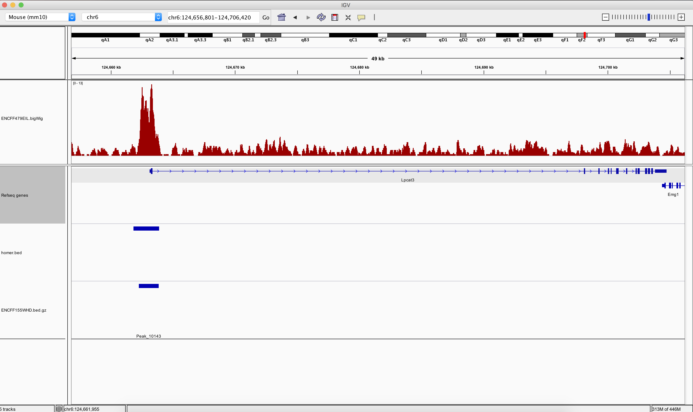

```{r setup, include=FALSE}
knitr::opts_chunk$set(echo = TRUE)
library(ggplot2)
library(magrittr)
```


## Coursework

This coursework  will review some of the key points of introduction to R, plotting in R and genomics data courses.

All students should download the zip file for this course work from [here](https://github.com/ThomasCarroll/BioInf2018CourseWork/archive/master.zip).

Student should include within this directory the R script containing the code to generate the required results under the Exercise/Question number the R code refers too.


For example.*(This is not the answer)*


# Question 1 - Read in the differential expression table and produce a data.frame of all results. How many genes have a padj < 0.05.
```
myRers <- read.delim("DE_Genes/Expression.csv",sep=">",header=FALSE)
length(myRers)
```


For exercise 2, question 7, a figure should be included within results directory.

For exercise 3, your Github ID should be included in an email to bioinformatics resource centre (brc@rockefeller.edu) by the deadline listed below.

The directory of R code and image for exercise 2, question 7 should be made available to me (brc@rockefeller.edu) by deadline below.


**The deadline for course work is April 30th, 2018**

### Exercise 1 - Working with Differential Gene expression results.

In this question we can review results from  the re-analysis of some publically available RNA-seq data.

The data we use is from the Encode consortium, Experiments ENCSR297UBP (GM12878 cell line) and ENCSR552EGO (HeLa cell lines)

The data is part of the Encode project and so more information can be found at the Encode portal.

I have already created a table of differentially expressed genes between GM12878 and HeLa and a table of gene expression values for all samples which you can find in directory **DE_Genes**.

Differential Expression Table - **DE_Genes/GM12878_Minus_HeLa_DEG.csv**

Absolute Expression Table - **DE_Genes/Expression.csv**

* Question 1 - Read in the differential expression table and produce a data.frame of all results. How many genes have a padj < 0.05.

```{r homerPeakss1,eval=FALSE,echo=FALSE,warning=FALSE,message=FALSE}
library(magrittr)
peakFile <- read.delim("DE_Genes/GM12878_minus_HeLa.csv",sep=",",comment.char = "#",header=T)
peakFile <- peakFile[!is.na(peakFile$padj) & !is.na(peakFile$log2FoldChange),]
write.table(peakFile,file="DE_Genes/GM12878_Minus_HeLa_DEG.csv",sep=",",quote=FALSE,row.names=FALSE)
load("~/Projects/Results/RNAseqPipeTest/FirstTest/DE_Genes/dds.RData")
myCounts <- counts(dds,normalized=TRUE)
write.table(data.frame(ID=rownames(myCounts),myCounts),file="DE_Genes/Expression.csv",sep=",",quote=FALSE,row.names=FALSE)
```

```{r homerPeakss1s,eval=TRUE,echo=FALSE,warning=FALSE,message=FALSE}
library(magrittr)
DEResults <- read.delim("DE_Genes/GM12878_Minus_HeLa_DEG.csv",sep=",",comment.char = "#",header=T)
Expression <- read.delim("DE_Genes/Expression.csv",sep=",",comment.char = "#",header=T,row.names=1)

#table(DEResults$padj < 0.05)
```


* Question 2 - Now with these genes with a padj < 0.05, create a scatter plot (as seen below) of -log10 pvalues on Y axis and log2FoldChange on X axis using ggplot2.

```{r homerPeakss12s,eval=TRUE,echo=FALSE,warning=FALSE,message=FALSE}
library(magrittr)
DEResults %>% dplyr::filter(padj < 0.05) %>% 
  ggplot(aes(x=log2FoldChange,y=-log10(pvalue)))+geom_point()+
  theme_minimal()+
  ylab("-log10 of Pvalue")+ggtitle("Volcano plot of GM12878 Minus HeLa")
```

* Question 3 - Read in the absolute expression table, add 1 to every value in table and make a boxplot of log10 expression values for all samples.

```{r homerPeakss1sqws,eval=TRUE,echo=FALSE,warning=FALSE,message=FALSE}
boxplot(log10(Expression+1))
```


* Question 4 - Now create a similar boxplot with just genes that have a padj < 0.05 and a log2FoldChange > 1.

```{r homerPeakssw1s,eval=TRUE,echo=FALSE,warning=FALSE,message=FALSE}

boxplot(log10(Expression[rownames(Expression) %in% DEResults$ID[DEResults$padj < 0.05 & DEResults$log2FoldChange >1],]+1))
```

* Question 5 - Using the absolute expression table, identify the genes whose expression is in the top 60%. Filter the results from the differential expression table to these results and plot the log2 basemean on X and log2FoldChange on Y. Highlight genes who have padj < 0.05

```{r homerPeakssas1s,eval=TRUE,echo=FALSE,warning=FALSE,message=FALSE}

top40 <- rownames(Expression)[rowMeans(Expression) > quantile(rowMeans(Expression),0.4)]
DEResults2 <- DEResults[DEResults$ID %in% top40,]
DEResults2$sigOrNot <- DEResults2$padj < 0.05
DEResults2 %>% 
  ggplot(aes(y=log2FoldChange,x=log2(baseMean),colour=sigOrNot))+geom_point()+
  theme_minimal()+
  xlab("log2 of baseMean")+ggtitle("MA plot of GM12878 Minus HeLa")

```

### Exercise 2 -  Working with HOMER peak calls for H3K27Ac signal.

In this question we can review some publically available data.

The data we use is H3K27Ac ChIP-seq from the Encode consortium, Experiment ENCSR863VHE and sample 1 (ENCBS844FSC) out of two replicates.

The data is part of the Encode project and so more information can be found at the Encode portal.

I have already identified a set of genomic locations enriched for H3K27Ac signal using the HOMER software and you will find this in the directory **HOMER_peaks**.

**HOMER_peaks/H3K27Ac_Limb_1.txt**

* Question 1 - Read in H3K27Ac_Limb_1.txt file and report the number of genomic locations listed in file.

```{r homerPeaks1,eval=TRUE,echo=FALSE,warning=FALSE,message=FALSE}
library(magrittr)
peakFile <- read.delim("HOMER_peaks/H3K27Ac_Limb_1.txt",sep="\t",comment.char = "#",header=F)
peakFile <- read.delim("HOMER_peaks/H3K27Ac_Limb_1.txt",sep="\t",comment.char = ">",header=T,skip=39)
```


* Question 2 - Make a histogram of the log10 of regions sizes as shown below using base graphics.

```{r homerPeaks3,eval=TRUE,echo=FALSE,warning=FALSE,message=FALSE}
hist(log10(peakFile$region.size),main = "Histogram log10 of region sizes",xlab="region sizes (log10)")
```

* Question 3 - Make a density plot of the log10 of regions sizes as shown below using ggplot graphics.


```{r homerPeaks4,eval=TRUE,echo=FALSE,warning=FALSE,message=FALSE}
library(ggplot2)
peakFile  %>% 
  ggplot(aes(x=region.size))+geom_density(fill="Darkgreen",colour="Darkgreen")+
  scale_x_log10()+
  theme_minimal()+
  xlab("region sizes (log10)")+ggtitle("Histogram log10 of region sizes")

```


* Question 4 - Make a density plot for each chromosome of the log10 of regions sizes as shown below using ggplot graphics.

```{r homerPeaks5,eval=TRUE,echo=FALSE,warning=FALSE,message=FALSE}
library(ggplot2)
peakFile  %>% 
  ggplot(aes(x=region.size))+geom_density(fill="Darkgreen",colour="Darkgreen")+
  scale_x_log10()+
  theme_minimal()+
  xlab("region sizes (log10)")+ggtitle("Histogram log10 of region sizes")+facet_wrap(~chr)

```


* Question 5 - Make a boxplot plot of the log10 of findPeaks.Score for each chromosome as shown below using ggplot graphics.

```{r homerPeaks6,eval=TRUE,echo=FALSE,warning=FALSE,message=FALSE}
library(ggplot2)
  ggplot(peakFile,aes(y=region.size,x=chr,fill=chr))+geom_boxplot()+coord_flip()+
  scale_y_log10()+
  theme_minimal()+
  xlab("region sizes (log10)")+ggtitle("Histogram log10 of region sizes")+coord_flip()

```


* Question 6 - Export the Homer genomic regions as a BED3 file.

```{r homerPeaks7,eval=TRUE,echo=FALSE,warning=FALSE,message=FALSE}
homerBED <- data.frame(peakFile[,2],peakFile[,3],peakFile[,4])
write.table(homerBED,"homer.bed",sep="\t",quote=FALSE,col.names = FALSE,row.names=FALSE)
```

* Question 7 - Load the generated BED3 file into IGV and compare to the peaks in bed/narrowPeak and signal p-value in bigWig format found at the Encode portal. Capture a image and include in results.



### Exercise 3 -  Create a Github account.

Github offers a good service for storage, organisation  and source control of our code.

Create a Github account for yourself following the instructions here [https://services.github.com/on-demand/intro-to-github/create-github-account](https://services.github.com/on-demand/intro-to-github/create-github-account). 

